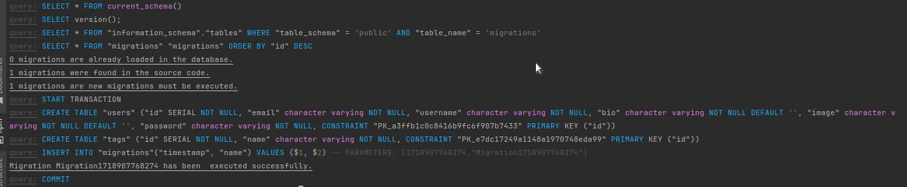

### Миграции в TypeOrm 0.3.x

В процессе разработки, возникло недопонимание с созданием [миграции  в TypeORM 0.3.20](https://typeorm.io/migrations)

Задача. 
Настроить создание миграций для удобства разработки. Инструкции, найденные в интернетах, написаны для 0.2 версии. А те, что
как бы написаны для 0.3 не "супер классно" объясняют процесс настройки.
Как всегда, разработчики все переделали, а доки не обновили. 

В общем, нужно делать немного не так...
Предполагается, что вы знакомы с предметом разговора, поэтому, рассматриваем только самое главное.

В файле кофигурации прописываем 
```ts

const AppDataSource = new DataSource({
    type: 'postgres',
    host: 'localhost',
    port: 5432,
    username: 'username',
    password: 'password123',
    database: 'database',
    entities: [__dirname + '../../**/*.entity{.ts,.js}'],
    synchronize: false,
    migrationsRun: false,
    migrations: [__dirname + '../../**/*-migration{.ts,.js}'],
});

export default AppDataSource;

```
Особое внимание обращаем на адресацию `entities`- нужна для генерации команд миграции, и `migrations` - нужная для запуска
сохраненных миграций. Если адресация неверно указывает, не будет генерить файлы и не будет их применять на базу. НО, никто
ничего вам "не скажет, не подсветит", а напишет, что `No changes in database schema were found - cannot generate a migration. To create a new empty migration use "typeorm migration:create" command`,
что меня заставляло думать, о необходимости запуска именно этой команды `typeorm migration:create`, но это немного не так

В файле `package.json` прописываем команды 
```json

    "typeorm": "typeorm-ts-node-commonjs  -d src/orm/ormconfig.ts",
    "db:drop": "npm run typeorm schema:drop",
    "db:sync": "npm run typeorm schema:sync",
    "migration:run": "npm run typeorm migration:run",
    "migration:show": "npm run typeorm migration:show",
    "migration:generate": "npm run typeorm migration:generate ./src/orm/migrations/migration"

```
Не нужно делать `"typeorm": "ts-node -r tsconfig-paths/register ./node_modules/typeorm/cli.js --config src/ormconfig.ts"`, 
у нас уже есть настроенный cli, если работаете с nest.js указываете `typeorm-ts-node-commonjs`, как в примере.

Теперь, самое интересное.
Запуск команд, точнее их порядок, _немного_ _отличается_ от того, что прописано в интернетах.

Команды по порядку:
- `npm run migration:run`, проверяем, что в базе создается табличка `migrations`
- `npm run migration:generate`, проверяем, что создался файл с требуемым действиями
- `npm run migration:run`, проверяем, что в базе накатились требуемые миграции

Вывод команд, должен быть похожим


В целом, это все. Спасибо.

Sponsored by [Hablsoft](https://www.hablsoft.com)
